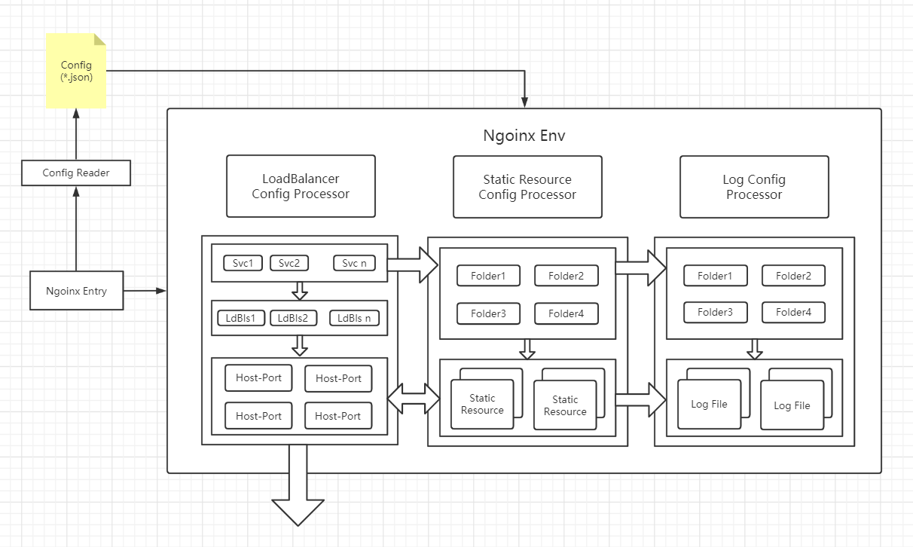
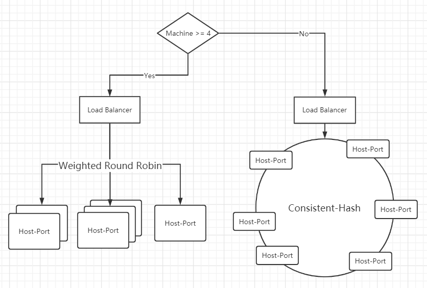
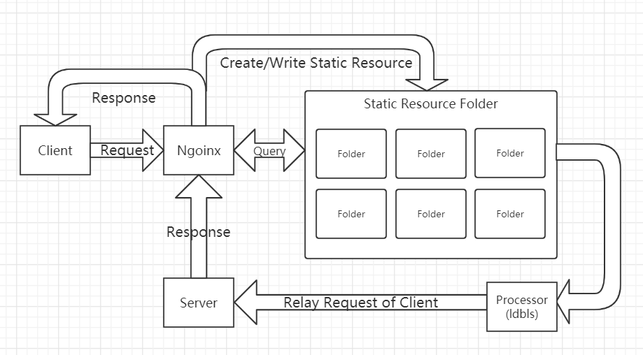

# :fish: ngoinx

（即将作为本鶸 “系统安全评估与综合实验” 个人项目演示的背景板之一）



## :hammer: 使用方式

### 1. 自定义配置文件

所有的设置在 `ngoinx.template.json` 中进行。具体键值对及其含义参照 [doc/config-format.md](https://github.com/skyleaworlder/ngoinx/blob/main/doc/config-format.md)。

### 2. 直接运行

```bash
go run ngoinx.go
```

## :pencil: 内容设计

### 1. 负载均衡

在 `src/ldbls/Ldbls.go` 中定义了 `LoadBalancer` 的 `interface`：

```go
type LoadBalancer interface {
  // Init is a init method
  Init(target []config.Target) (err error)

  // GetAddr is a method to Get URL.Scheme+"://"+URL.Host
  GetAddr(req *http.Request) (addr string, err error)

  // Loggerable need to implement method "SetLogger"
  utils.Loggrable
}
```

负载均衡只需要 “初始化” 以及 根据给定的 `Request` “获取对应目的主机” 两种特性。
仓库中实现了 “一致性哈希” 和 “权重轮询法” 两种负载均衡算法，都实现了该接口。

在 `src/ldbls/Ldbls.go` 中，有对使用何种负载均衡算法的选择标准。目前是：

* 1~3 台：权重轮询法；
* 4 台及以上：一致性哈希。



可以通过更改 `src/ldbls/Ldbls.go` 中逻辑以及添加新的 “实现了 `interface LoadBalancer` 的变量类型” 做到添加新的负载均衡器。

### 2. 动静分离

在 `src/staticfs` 中定义了 `struct Folder` 以及对应的 `struct FolderManager`。通过 `ngoinx.json` 中 `service[i].static` 和 `service[i].proxy[j].src` 的值创建 “静态资源文件夹”。

#### i. 静态资源管理

`struct FolderManager` 实现了 `clean` 方法，用于检查 “静态资源文件夹” 内是否出现异常情况，如：

* 空文件（出现原因：由于各种因素导致的写入失败）
* 过期文件（出现原因：缓存文件最后 `ModTime` 过早）

那么 `clean` 会删掉它们。

#### ii. 静态资源缓存

发出请求时，会使用 `utils` 中工具判断是否为 “静态资源请求”。对远程目标的静态资源请求前，会检查对应文件夹中是否存在 “静态资源缓存”：



* 若不存在该资源，会转而向远端请求，并将请求的资源 “缓存” 在 “静态资源文件夹” 内，交由 `FolderManager` 管理；
* 若存在，则将其直接传给请求方。

### 3. 反向代理

反向代理由 `net/http` 间接实现，我并没有写多少代码。

对于 `src` 到 `dst` 的映射，则是 `json` 配置文件的事情。

### 4. 配置读取

#### i. 配置构成

使用 `gjson` 读取 `json` 配置文件，并将读取结果放入位于 `src/config/GLOVAR.go` 中的全局变量 `Svc []config.Service` 保存。

配置文件大体由三层构成：

* 一层：`Service`；
* 二层：`Proxy`；
* 三层：`Target`。

`src/config` 中的 `Service.go, Proxy.go` 实现了 `Service, Proxy, Target` 三种 `struct`，都实现了 `Unmarshal` 方法。

该方法是实现 `interface Unmarshaler` 的必由之路。三者都可使用该方法将 `gjson.Result` 装填至 `struct` 中。

#### ii. 装填过程

装填 `config.Svc` 只需调用 `utils.ReadConfig(path string)`。

* 该函数首先会读取配置文件，获取 `gjson.Result`；
* 此后将 `gjson.Result` 通过 `utils.initService` 装入 `config.Svc`。

## :heart: 缘由

* 思索 “系统安全评估与综合实验” 个人项目的项目选题；
* 无论什么选题，都想新学一门语言；
* 水群的时候通过 `@luyanaa` 大佬的名号联想到 `Lua`；
* 计划接触 `Lua` 时听闻其被用作开发 `nginx` 插件；
* 对 `nginx` 最最基本功能的好奇...

写得差不多了，很拉胯但是凑合能用。可惜这次连满足感都很少，只有失落与不安。
